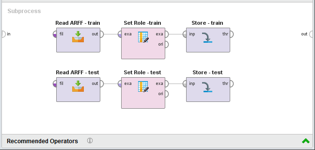
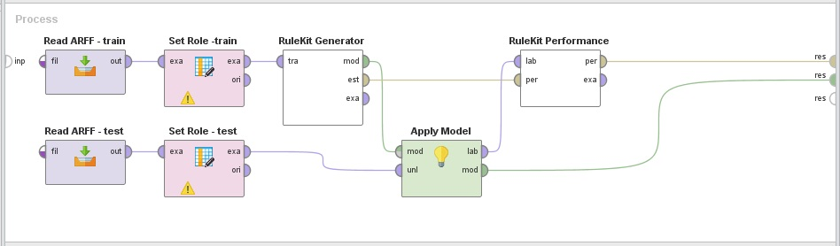
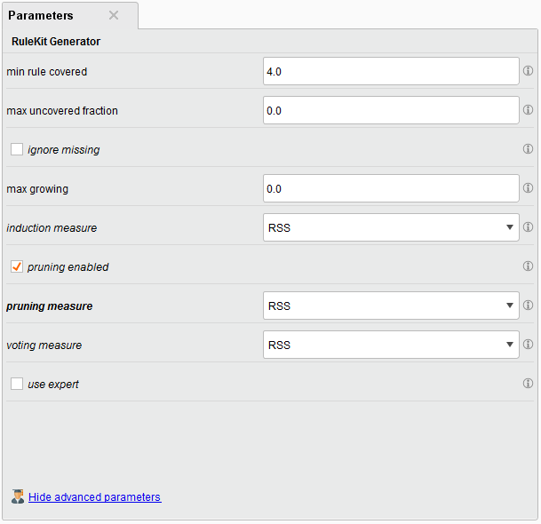
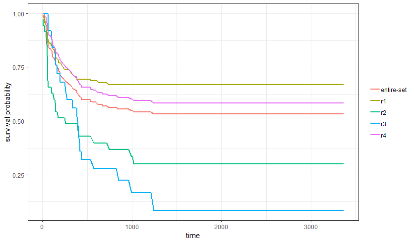
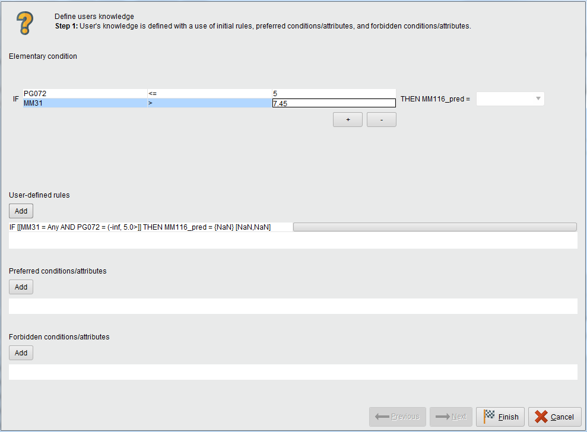

# RuleKit

RuleKit is a comprehensive library for inducing rule-based data models [X]. It has the ability to produce classification [X], regression [X], and survival rules [X]. The suite provides user with the possibility to introduce a priori knowledge [X]. The powerful and flexible experimental environment allows straightforward investigation of different induction schemes. The analysis can be performed in batch mode, through RapidMiner plugin, or R package. A Java API is also provided for convinience. 

# Table of contents

1. [Batch interface](#1-batch-interface)
    1. [General information](#11-general-information)
    2. [Parameter set definition](#12-parameter-set-definition)
    3. [Dataset definition](#13-dataset-definition)
    4. [Example](#14-example)
2. [RapidMiner plugin](#2-rapidminer-plugin)
	1. [Installation](#21-installation)
	2. [Usage](#22-usage)
	3. [Example](#23-example)
3. [R package](#3-r-package)
	1. [Installation](#31-installation)
	2. [Usage](#32-usage)
	3. [Example](#33-example)
4. [Quality and evaluation](#4-quality-and-evaluation)
    1. [Rule quality](#41-rule-quality)
	2. [Model characteristics](#42-model-characteristics)
	2. [Performance metrices](#43-performance-metrices)
5. [Output files](#4-output-files)
    1. [Training report](#51-training-report)
    2. [Prediction performance report](#52-prediction-performance-report)    	
6. [User-guided induction](#6-user-guided-induction)
7. [Library API](#7-library-api)
   
   [References](#references)

<!-- toc -->

# 1. Batch interface

## 1.1. General information

To run the analysis in the batch mode, use RuleKit JAR package (see Release tab for download):
```
java -jar RuleKit experiments.xml
```
where *experiments.xml* is an XML file with experimental setting description. The batch mode allows investigating multiple datasets with many induction parameters. The general XML structure is as follows:

```xml
</experiment>
	<parameter_sets>
		<parameter_set name="paramset_1">...</parameter_set>
		<parameter_set name="paramset_2">...</parameter_set>
		...
	</parameter_sets>

	<datasets>
		<dataset>...</dataset>
        	<dataset>...</dataset>
   		...
  	</datasets>
</experiment>
```

## 1.2. Parameter set definition

This section allows user to specify induction parameters. The package enables testing multiple parameter sets in a single run. The definition of a single parameter is presented below. Every parameter has its default value, thus only selected may be specified by the user. 

```xml
<parameter_set name="paramset_1">
  	<param name="min_rule_covered">...</param>
  	<param name="max_uncovered_fraction">...</param>
	<param name="max_growing">...</param>
  	<param name="induction_measure">...</param>
	<param name="pruning_measure">...</param>
  	<param name="voting_measure">...</param>
	<param name="user_induction_equation">...</param>
	<param name="user_pruning_equation">...</param>
	<param name="user_voting_equation">...</param>
	<param name="ignore_missing">...</param>
</parameter_set>
```    

where:

* `min_rule_covered` - positive integer representing minimum number of previously uncovered examples to be covered by a new rule (positive examples for classification problems); default: 5,
* `max_uncovered_fraction` - floating-point number from [0,1] interval representing maximum fraction of examples that may remain uncovered by the rule set; default: 0,
* `max_growing` - non-negative integer representing maximum number of conditions which can be added to the rule in the growing phase (use this parameter for large datasets if execution time is prohibitive); 0 indicates no limit; default: 0,
* `induction_measure`/`pruning_measure`/`voting_measure` - name of the [rule quality measure](#41-rule-quality) used during growing/pruning/voting (ignored in the survival analysis where log-rank statistics is used); default: *Correlation*, 
* `user_induction_equation`/`user_pruning_equation`/`user_voting_equation` - equation of user-defined quality measure; applies only when the corresponding measure parameter has value *UserDefined*; the equation must be a mathematical expression with *p, n, P, N* literals (elements of confusion matrix), operators, numbers, and library functions (sin, log, etc.).
* `ignore_missing` - boolean telling whether missing values should be ignored (by default, a missing value of given attribute is always considered as not fulfilling the condition build upon that attribute); default: false. 

Additional parameters concerning user-guided generation of rules are described [in this section](#6-user-guided-induction). 


## 1.3. Dataset definition

Definition of a dataset has the following form. 

```xml
<dataset>
     <label>...</label>							
     <out_directory>...</out_directory>			
     <weight>...</weight>                       
     <survival_time>...</survival_time>         
    
    <training> 
          <report_file>...</report_file>         
	  <train>
             <in_file>...</in_file>            
             <model_file>...</model_file>      
         </train>
         ...
    </training>
    
    <prediction>
	 <report_file>...</report_file>   	 
         <predict>
             <model_file>...</model_file>      	
             <test_file>...</test_file>         
             <predictions_file>...</predictions_file>  
         </predict>
         ...
    </prediction>
    
</dataset>
```
There are three main parts of the dataset definition: the general properties, the `traning` section, and the `prediction` section. General parameters and at least one of the two latter sections must be specified. 

### General properties

The general dataset properties are:
* `label` - label attribute,
* `out_directory` - output directory for storing results, subdirectories for all parameter sets are created automatically inside it,
* `weight` - optional weight attribute,
* `survival_time` - name of the survival time attribute, its presence indicates survival analysis problems.

### Training section

The `training` section allows generating models on specified training sets. It consists of the `report_file` field and any number of `train` subsections. Each `train` subsection is defined by:
* `in_file` - full path to the training file (in ARFF, CSV, XLS format),
* `model_file` - name of the output model file (without full path); for each parameter set, a separate model is generated under location *<out_directory>/<parameter_set name>/<model_file>*.

The `report_file` is created for each parameter set under *<out_directory>/<parameter_set name>/<report_file>* location. It contains a common text report for all training files: rule sets, model characteristics, detailed coverage information, training set prediction quality, KM-estimators (for survival problems), etc. Details on its content can be found [here](#51-training-report).

### Prediction section

The `prediction` section allows making predictions on specified testing sets using models generated by the `training` section. It consists of the `performance_file` field and any number of `predict` subsections. Each `predict` subsection is defined by:
* `model_file` - name of the input binary model file generated in the `training` part; for each parameter set, a model is searched under location *<out_directory>/<parameter_set name>/<model_file>*, 
* `test_file` - full path to the testing file (in ARFF, CSV, XLS format),
* `predictions_file` - output data file with predictions (without full path); for each parameter set, a prediction is generated under location *<out_directory>/<parameter_set name>/<predictions_file>*.

The `performance_file` is created for each parameter set under *<out_directory>/<parameter_set name>/<performance_file>* location. It contains a common CSV report for all testing files with values of performance measures. [In this section](#52-prediction-performance-report) one can find all the information concerning performance report.
 

## 1.4. Example

Here we present how to prepare the XML experiment file for an example classification problem. The investigated dataset concerns a problem of forecasting high energy seismic bumps in coal mines and is named *seismic-bumps*. The entire dataset in ARFF format as well as 10-fold cross validation splits can be found [here](data/seismic-bumps).

Let the user be interested in two parameter sets:
* *mincov = 5* with *RSS* measure used for growing, pruning, and voting,
* *mincov = 8* with *BinaryEntropy* measure used for growing, user-defined measure described by the equation *2p/n* for pruning, and *C2* for voting.

The corresponding parameter set definition is as follows:
```xml
<parameter_sets>
	<parameter_set name="mincov=5, RSS">
		<param name="min_rule_covered">5</param>
		<param name="induction_measure">RSS</param>
		<param name="pruning_measure">RSS</param>
		<param name="voting_measure">RSS</param>
	</parameter_set>
	
	<parameter_set name="mincov=8, Entropy_User_C2">
		<param name="min_rule_covered">8</param>
		<param name="induction_measure">BinaryEntropy</param>
		<param name="pruning_measure">UserDefined</param>
		<param name="user_pruning_equation">2 * p / n</param>
		<param name="voting_measure">C2</param>
	</parameter_set>
	
</parameter_sets>
```    

The experiment will be performed in 10-fold cross validation scheme with existing splits:
* name of the label attribute: `class`,
* no weighting,
* output directory: *./results-seismic-bumps* 
* training files:
    * *./data/seismic-bumps-train-0.arff*
    * *./data/seismic-bumps-train-1.arff*
    * ...
    * *./data/seismic-bumps-train-9.arff*
* training log file: *training.log*
* testing files:
    * *./data/seismic-bumps-test-0.arff*
    * *./data/seismic-bumps-test-1.arff*
    * ...
    * *./data/seismic-bumps-test-9.arff*
* testing performance file: *performance.csv*

The corresponding dataset definition is as follows:

```xml
<dataset>
     <label>class</label>
     <out_directory>./results-seismic-bumps</out_directory>		
    
    <training>  
         <report_file>training.log</report_file>           		
         <train>
             <in_file>../data/seismic-bumps/seismic-bumps-train-0.arff</in_file>               	
             <model_file>seismic-bumps-0.mdl</model_file> 
         </train>
		 
		  <train>
             <in_file>../data/seismic-bumps/seismic-bumps-train-1.arff</in_file>               	
             <model_file>seismic-bumps-1.mdl</model_file> 
         </train>
         ...
		<train>
             <in_file>../data/seismic-bumps/seismic-bumps-train-9.arff</in_file>               		
             <model_file>seismic-bumps-9.mdl</model_file>  
         </train>
	 

    </training>
    
    <prediction>
     	<performance_file>performance.csv</performance_file>  
         <predict>
             <model_file>seismic-bumps-0.mdl</model_file>      	
             <test_file>../data/seismic-bumps/seismic-bumps-test-0.arff</test_file>            			
             <predictions_file>seismic-bumps-pred-0.arff</predictions_file>  	  
         </predict>
		 
		  <predict>
             <model_file>seismic-bumps-1.mdl</model_file>      	
             <test_file>../data/seismic-bumps/seismic-bumps-test-1.arff</test_file>            			
             <predictions_file>seismic-bumps-pred-1.arff</predictions_file>  	  
         </predict>
		 ...
	 
		<predict>
             <model_file>seismic-bumps-9.mdl</model_file>      	
             <test_file>../data/seismic-bumps/seismic-bumps-test-9.arff</test_file>            			
             <predictions_file>seismic-bumps-pred-9.arff</predictions_file>   	
         </predict>

	 
    </prediction>
    
</dataset>
```

In the training phase, RuleKit generates a subdirectory in the output directory for every investigated parameter set. 
Each of these subdirectories contains models (one per training file) and a common text report. 
Therefore, the following files are produced as a result of the training:
* *./results-seismic-bumps/mincov=5, RSS/seismic-bumps-0.mdl*
* *./results-seismic-bumps/mincov=5, RSS/seismic-bumps-1.mdl*
* *...*
* *./results-seismic-bumps/mincov=5, RSS/seismic-bumps-9.mdl*
* *./results-seismic-bumps/mincov=5, RSS/training.log*
* *./results-seismic-bumps/mincov=8, Entropy_User_C2/seismic-bumps-0.mdl*
* *./results-seismic-bumps/mincov=8, Entropy_User_C2/seismic-bumps-1.mdl*
* *...*
* *./results-seismic-bumps/mincov=8, Entropy_User_C2/seismic-bumps-9.mdl*
* *./results-seismic-bumps/mincov=8, Entropy_User_C2/training-log.txt*

In the prediction phase, previously-generated models are applied on the specified testing sets producing the following files:
* *./results-seismic-bumps/mincov=5, RSS/seismic-bumps-pred-0.arff*
* *./results-seismic-bumps/mincov=5, RSS/seismic-bumps-pred-1.arff*
* *...*
* *./results-seismic-bumps/mincov=5, RSS/seismic-bumps-pred-9.arff*
* *./results-seismic-bumps/mincov=5, RSS/performance.csv*
* *./results-seismic-bumps/mincov=8, Entropy_User_C2/seismic-bumps-pred-0.arff*
* *./results-seismic-bumps/mincov=8, Entropy_User_C2/seismic-bumps-pred-1.arff*
* *...*
* *./results-seismic-bumps/mincov=8, Entropy_User_C2/seismic-bumps-pred-9.arff*
* *./results-seismic-bumps/mincov=8, Entropy_User_C2/performance.csv*   

The complete experiment definition in XML format is available [here](examples/classification.xml). 

# 2. RapidMiner plugin

## 2.1. Installation

In order to integrate RuleKit with RapidMiner please download *adaa.analytics.rules-1.0.0-all.jar* plugin file (see Release tab) and place it in one of the following locations:
* *lib/plugins* subdirectory in the RapidMiner installation directory,
* *Extension directory* location (*RapidMiner Studio Preferences &rarr; Start-up* menu).

## 2.2. Usage

The plugin consists of two operators:
* *RuleKit Generator*,
* *RuleKit Performance*,

which can be found in *Extensions &rarr; ADAA &rarr; RuleKit* folder. 

The former operator allows inducing various typles of rule models. It is a RapidMiner learner with a single *training set* input and three outputs: *model* (to be applied on unseen data), *example set* (input training set passed without any changes), and *estimated performance* ([model characteristics](#42-model-characteristics)). RuleKit automatically determines the type of the problem on the basis of the training set metadata:  
* classification - nominal label attribute,
* regression - numerical label attribute,
* survival analysis - binary label attribute and numerical attribute with role *survival_time* specified.

The metadata are crucial for proper operation as they define available GUI parameters and induction algorithm to be used.

The *RuleKit Performance* operator allows assesing the model. It conforms to the standart *Performance* RM operator, thus it  contains *labelled data* and *performance* inputs. The former allows calculating various [performance metrices](#43-performance-metrices) on the predicted data, the latter can be used to capture [model characteristics](#42-model-characteristics) returned by the *RuleKit Generator*. 

## 2.3. Example

In the following subsection we show an example regression analysis with a use of RuleKit RapidMiner plugin. The investigated dataset is named *methane* and concerns the problem of predicting methane concentration in a coal mine. The set is split into separate testing and training parts distributed in ARFF format ([download](data/methane)). The analysis is divided into two parts: data preparation and main processing. Corresponding RapidMiner processes are presented in Figure 2.1 and 2.2.

The role of the preparation process is to add metadata to the sets and store them in the RM format (RapidMiner does not support metadata for ARFF files). After loading sets with *Read ARFF*, the *Set Role* operator is used for setting *MM116_pred* as the label attribute (in the survival analysis, a *survival_time* role has to be additionally assigned to some other attribute). Then, the sets are saved in the RapidMiner local repository with *Store* operators.

In the main process, datasets are loaded from the RM repository with *Retrieve* operator. Then, the training set is provided as an input for *RuleKit Generator*. All the parameters configurable from the XML interface are accessible through the RapidMiner GUI. Let *mincov = 4* and *RSS* measure be used for growing, pruning, and voting. The corresponding panel with operator properties is presented in Figure 2.3. 

||
|:--:| 
|  | 
| Figure 2.1. Data preparation process. |
|  | 
| Figure 2.2. Main analysis process. |
|  | 
| Figure 2.3. RuleKit Generator parameters. |

The model generated by RuleKit Generator is then applied on unseen data (*Apply Model* operator). The performance of the prediction is assesed using *RuleKit Evaluator* operator. [Performance metrices](#43-performance-metrices) as well as generated model are passed as process outputs. The text representation of the model was presented in the [training report description](#51-training-report).

# 3. R package

## 3.1. Installation

## 3.2. Usage
After installation, the package is imported with `library("adaa.rules")` command. Input datasets have to be in the form of standard R data frames with colums and rows representing variables and examples, respectively. 

Training of the rule-based model is done with the following function:
```
learn_rules(formula, control = NULL, train_data, test_data = train_data)
```
Parameters:
* `formula` - R model formula. In general, formulae have the form `response variable ~ predictor variables`. RuleKit, however, ignores the *predictor variables* part and performs the analysis on the basis of all conditional attributes unless [user-guided induction](#6-user-guided-induction) is enabled. Thus, in the case of classification and regression problems, use `response variable ~ .` as the formula. In the case of survival problems, user must additionally specify an attribute representing survival in the formula: `survival::Surv(survival time, survival status) ~ .`
* `control` - named list of induction parameters. When `control` argument is not specified, default algorithm configuration is used. This paramter is also used when specifying user's requirements in user-guided induction.
* `train_data` - training data set.
* `test_data` - testing data set. If not specified, training set is used for evaluation.

 <!--- 
| Formula 				| Predictor variable |
| :--- 					| :--- |
| *Y ~ P* 				| *P* |
| *Y ~ .* 				| all variables (beside *Y*) |
| *Y ~ P + Q + R* 		| *P*, *Q*, and *R* |
| *Y ~ P:Q* 			| interaction between *P* and *Q* |
| *Y ~ P\*Q* 			| *P*, *Q*, and interaction between them;  same as *P + Q + P:Q*|
| *Y ~ (P+Q+Z)^2* 		| *P*, *Q*, *R* and their second order interactions;  same as *P + Q + Z + P:Q + P:R + Q:R*|
| *Y ~ (P+Q+Z)^2 - Q:R	| *P*, *Q*, *R* and their second order interactions beside *Q:R* |
| *Y ~ P|Q*				| *P* given *Q* |
--->

## 3.3. Example

In this subsection we present a survival analysis of *BMT-Ch* dataset with RuleKit R package. After loading the package,  survival time and survival status variables are specified and induction parameters are set. Note, that in survival problems, log-rank statistic is always used as a rule quality measure. 
```r
library(adaa.rules)
formula <- survival::Surv(survival_time, survival_status) ~ .
control <- list(min_rule_covered = 5)
```
In the next step, the analysis is initialized (training and testing performed on the same set) and the results are gathered. 
```r
results <- learn_rules(formula, control, bone_marrow)
performance <- results[[1]] # data frame with validation performance metrics
report <- results[[2]]      # text training report
```
The second element of resulting list is a [training report](#51-training-report). In the following lines, the list of rules and survival functions are extracted from the report.
```r
# get separating empty lines in the report
separators <- which(report == "")

# extract rules from the report
start <- which(report == "Rules:") + 1
rules <- report[start : (separators[which(separators > start)[1]] - 1)] # first separator after start

# extract survival function estimates from the report
start <- which(report == "Estimator:") + 1
estimates <- report[start : (separators[which(separators > start)[1]] - 1)] # first separator after start

# convert estimates into data frame with following columns:
# - time - survival time,
# - entire-set - values of survival function of entire dataset,
# - r1, r2, ... - values of survival function for rules r1, r2, etc.
names <- strsplit(estimates[1],',')[[1]]
data <- lapply(estimates[2:length(estimates)], function(row) {
  vals <- strsplit(row,',')[[1]]
  as.numeric(vals)
})
surv <- data.frame(matrix(unlist(data), nrow=length(data), byrow=T))
colnames(surv) <- names
```
Survival function estimates for the rules and for the entire dataset are then plotted (Figure 3.1).
```r
library(ggplot2)
library(reshape2)

# melt dataset for automatic plotting of multiple series
meltedSurv <- melt(surv, id.var="time")

ggplot(meltedSurv, aes(x=time, y=value, color=variable)) +
  geom_line(size=1.0) +
  xlab("time") + ylab("survival probability") +
  theme_bw() + theme(legend.title=element_blank())
```


||
|:--:| 
|  | 
| Figure 3.1. Survival function estimates for the rules and for the entire *BMT* dataset. |

The entire R script for performing survival analysis for *BMT* dataset can be found [here](examples/survival.R).

# 4. Quality and evaluation
 
## 4.1. Rule quality

An important factor determining performance and comprehensibility of the resulting model is a selection of a rule quality measure. RuleKit provides user with a number of state-of-art measures calculated on the basis of the confusion matrix. The matrix consists of the number of positive and negative examples in the entire training set (*P* and *N*) and the number of positive and negative examples covered by the rule (*p* and *n*). The measures based on the confusion matrix can be used for classification and regression problems (note, that for the former *P* and *N* are fixed for each analyzed class, while for the latter *P* and *N* are determined for every rule on the basis of covered examples). In the case of survivall problems, log-rank statistics is always used for determining rules quality (for simplicity, all examples are assumed positive, thus *N* and *n* equal to 0). Below one can find all available measures together with formulas. 

| Quality measure 			| Formula |
| :--- 						| :--- |
| Accuracy 					|  | 
| BinaryEntropy				| \sum_{y{\in}Y}P(y\|x)\log_2{P(y\|x)}), where  <br> the probabilities can be calculated straightforwardly from the confusion matrix [X]
| C1						|   |  
| C2						| |  
| CFoil						| -{{\log}_{2}}\left(\frac{P}{P%2BN}\right)\right))|  
| CNSignificnce				| \frac{P}{P%2BN}}\right)%2Bn\ln\left(\frac{n}{\left(p%2Bn\right)\frac{N}{P%2BN}}\right)\right))| 
| Coleman					| })|  
| Correlation				| (P-p%2BN-n)}})|  
| Coverage					|  |  
| FBayesianConfirmation		| |  
| FMeasure					| \left(\frac{p}{p%2Dn}\right)\left(\frac{p}{P}\right)}{\beta^2\left(\frac{p}{p%2Dn}\right)%2B\frac{p}{P}},{\quad\quad}\beta=2)|  
| FullCoverage				| /(P%2BN))|  
| GeoRSS					| })|  
| GMeasure					| ,{\quad\quad}g=2) | 
| InformationGain			| -Inf{{o}_{pn}}\left(P,N\right),Info\left(P,N\right)=-\left[\frac{P}{P+N}{{\log}_{2}}\frac{P}{P+N}+\frac{N}{P+N}{{\log}_{2}}\frac{N}{P+N}\right])Inf{{o}_{pn}}\left(P,N\right)=\frac{p+n}{P+N}Info\left(p,n \right)+\frac{P+N-p-n}{P+N}Info\left(P-p,N-n\right))|  
| JMeasure					| }{\left(p%2Bn\right)P}\right)%2Bn\ln\left(\frac{n\left(P%2BN\right)}{\left(p%2Bn\right)N}\right)\right))|  
| Kappa						| \left(\frac{p}{p%2Bn}\right)-P}{\left(\frac{P%2BN}{2}\right)\left(\frac{p%2Bn%2BP}{p%2Bn}\right)-P})|  
| Klosgen					| ^{\omega}\left(\frac{p}{p%2Bn}-\frac{P}{P%2BN}\right),{\quad\quad}\omega=1)|  
| Laplace					| /(p%2Bn%2B2)) | 
| Lift						| }{\left(p%2Bn\right)P})|  
| LogicalSufficiency		| |  
| MEstimate					| |  
| MutualSupport				| |  
| Novelty					| }{{{\left(P%2BN\right)}^{2}}}\right))|  
| OddsRatio					| }{n\left(P-p\right)})|  
| OneWaySupport				| }{\left(p%2Bn\right)P}\right))|  
| PawlakDependencyFactor	| -P\left(p%2Bn\right)}{p\left(P%2BN\right)%2BP\left(p%2Bn\right)})|  
| Q2						| \left(1-\frac{n}{N}\right))|  
| Precision					| )| 
| RelativeRisk				| )|  
| Ripper					| /(p%2Bn))|  
| RuleInterest				| -\left(p%2Bn\right)P}{P%2BN})|  
| RSS						| |  
| SBayesian					| |  
| Sensitivity				| |  
| Specificity				| /n)|  
| TwoWaySupport				| }{\left(p%2Bn\right)P}\right))|  
| WeightedLaplace			| \left(P%2BN\right)}{\left(p%2Bn%2B2\right)P})|  
| WeightedRelativeAccuracy	| )|  
| YAILS						| \frac{p}{p%2Bn}%2B{(0.5-0.25{\cdot}Precision)}\frac{p}{P}) |

During model construction, the significance of rules is assesed statistically using following tests:
* classification: Fisher's exact test for for comparing confusion matrices,
* regression: &Chi;<sup>2</sup>- test for comparing label variance of covered vs. uncovered examples,
* survival: log-rank for comparing survival functions of covered vs. uncovered examples. 


## 4.2. Model characteristics

These indicators are common for all types of problems and their values are established during model construction.

* `time_total_s` - algorithm execution time in seconds,
* `time_growing_s` - growing time in seconds, 
* `time_pruning_s` - pruning time in seconds,
* `#rules` - number of rules,
* `#conditions_per_rule` - average number of conditions per rule,
* `#induced_conditions_per_rule` - average number of induced conditions per rule (before pruning),
* `avg_rule_coverage` - average rule full coverage defined as (*p* + *n*) / (*P* + *N*),
* `avg_rule_precision` - average rule precision defined as *p* / (*p* + *n*),
* `avg_rule_quality` - average value of voting measure,
* `avg_pvalue` - average rule *p*-value
* `avg_FDR_pvalue` - average rule *p*-value after false discovery rate (FDR) correction,
* `avg_FWER_pvalue` - average rule *p*-value after family-wise error (FWER) correction,
* `fraction_0.05_significant` - fraction of significant rules at &alpha = 0.05,
* `fraction_0.05_FDR_significant` - fraction of significant rules at 0.05 level (with FDR correction),
* `fraction_0.05_FWER_significant` - fraction of significant rules at 0.05 level (with FWER correction).

## 4.3. Performance metrices

Performance metrices are established on the basis of model outcome and real example labels. They are specific for investigated problem.

### Classification

* accuracy
* classification_error
* balanced_accuracy
* kappa  
* #rules_per_example - average number of rules covering an example,
* #voting_conflicts - number of voting conflicts (example covered by rules pointing to different classes),
* #negative_voting_conflicts - number of voiting conflicts resolved incorrectly,
* cross-entropy
* margin
* soft_margin_loss
* logistic_loss

In binary classification problems some additional metrices are computed:

* precision
* recall
* lift
* fallout
* f_measure
* false_positive
* false_negative
* true_positive
* true_negative
* sensitivity
* specificity
* youden
* positive_predictive_value
* negative_predictive_value
* psep
* geometric_mean

### Regression

* absolute_error 
* relative_error
* relative_error_lenient
* relative_error_strict
* normalized_absolute_error
* root_mean_squared_error
* root_relative_squared_error
* squared_error
* correlation
* squared_correlation

### Survival

* integrated_brier_score

# 5. Output files

During training phase, RuleKit produces following types of files:
* a model file (one per each training set) that can be applied in the prediction stage,
* a text report (common for all training files).
The result of the prediction phase are:
* a prediction file (one per each testing set), 
* a performance report (common for all testing files).
In the following subsections, a detailed description of training and performance reports are given. 

## 5.1. Training report

The report consists of separated sections, each corresponding to a single traning file:

```
================================================================================
bone-marrow-test-0.arff

... # content

================================================================================
bone-marrow-test-1.arff

... # content

```

At the beginning of a section, a rule model is given:

```
r1: IF Relapse = {0} AND Donorage = (-inf, 45.526027) AND Recipientage = (-inf, 17.45) THEN survival_status = {NaN} (p=119.0, n=0.0, P=168.0, N=0.0, weight=0.9999992726837377, pvalue=7.27316262327804E-7)
r2: IF HLAmismatch = {0} AND Relapse = {1} THEN survival_status = {NaN} (p=21.0, n=0.0, P=168.0, N=0.0, weight=0.9981544870337137, pvalue=0.0018455129662863223)
r3: IF Relapse = {0} AND Rbodymass = (-inf, 69.0) AND Recipientage = (-inf, 18.0) THEN survival_status = {NaN} (p=127.0, n=0.0, P=168.0, N=0.0, weight=0.9999999653103507, pvalue=3.468964926423013E-8)
r4: IF aGvHDIIIIV = {1} AND ANCrecovery = (-inf, 19.5) AND Stemcellsource = {1} AND Txpostrelapse = {0} THEN survival_status = {NaN} (p=82.0, n=0.0, P=168.0, N=0.0, weight=0.999992179496458, pvalue=7.820503541977608E-6)
r5: IF Donorage = <28.028767000000002, inf) AND CD34kgx10d6 = <1.2650000000000001, 6.720000000000001) AND CD3dCD34 = <0.8878985, inf) AND Rbodymass = <31.5, inf) AND Recipientage = <11.55, inf) THEN survival_status = {NaN} (p=20.0, n=0.0, P=168.0, N=0.0, weight=0.9999999999914838, pvalue=8.516187754992188E-12)
```
For each rule, additional statistics are given in the parentheses:
* elements of confusion matrix *p*, *n*, *P*, *N*,
* weight - value of the voting quality measure,
* *p*-value - rule significance.

Rules are followed by the detailed information about training set coverage:
```
Rules covering examples from training set (1-based):
2,4*;2*;3,5*;1,3*,4;1,3*;1,3*;1,3*;1,3*,4;1,3*;1,3*,4;3*,4;1,3,5*;1,3*;2*;1,3*,4;1,3*,4;2*;1,3*,4;1,3,5*;1,3*;1*;1,3*,4;3*,4;4,5*;3*,4;1,3*,4;1,3*,4;1,3*,4;1,3*,4;1,3*;1*,4;1,3*;1,3*;3*;1,3*,4;1,3*;1,3*,4;5*;1,3*,4;2*;3,5*;1,3*,4;1,3*;2,5*;1,3*,4;1,3*,4;3*,4;1,3*;1,3*;1,3*,4;2,4*;1,3*,4;4,5*;1,3*;2*;1,3*;2*;1,3*,4;1,3*;1,3*,4;3*;5*;1,3*,4;1,3*,4;1,3*;1,3*;1,3*,4;3,4,5*;4*;1,3*,4;1,3*;1,3*;1,3*,4;5*;4*;1,3*,4;1,3*,4;2*;1,3*;1,3*;1,3*;1,3*;1,3*;1,3*;1,3*,4;1,3*,4;1,3*;1,3*;1,3,5*;1,3*;1,3*,4;5*;1,3*;2*;1,3*;1*,4;1,3*,4;1,3*,4;1,3*,4;1,5*;1,3*;1,3*;4*;1,3*;3,5*;3*;1,3,4,5*;1,3*;5*;2*;1,3*;1,3*;1*,4;1,3*;1,3*,4;1,3*;1,3*,4;3*,4;1,3*;1,3*,4;4*;1,3*,4;1,3*;1,3*,4;4*;1,3*;1,3*;1,3*;1,3*,4;1*;1,3*,4;1,3*,4;2*;1,3*,4;1,3*,4;1,3,5*;2,4*;1,3*;1,3*,4;1,3*,4;1,3*;2,4*;1,3*,4;3*,4;1,3*,4;1,3*;1,3*;1,3*;1,3*,4;1,3*,4;1,3*,4;1,3*;1,3*;5*;2,4*;2*;1,3,5*;2,4*;3*;1,3*;2,4*;1,3*,4;1,3*,4;1,3*,4;1,3*,4;2*;4*;2,4*
```
For each example from the training set, a comma-separated list of rules covering that example is specified. Best rule (one with highest weight is marked with asterisk, lists corresponding to consecutive examples are separated with semicolon. The record `2,4*;2*;` at the beginning indicates that the first training example was covered by rules `r2` and `r4` (of which `r4` was the best), while the second training example was covered by `r2` only.  

Another section of the training report applies to survival problems only and contains tabular representation of survival curves. The first column represents time, then there are survival estimates of the entire training set and induced rules. This can be used for visualization of the algorithm results.
```
Estimator:
time, entire-set, r1, r2, r3, r4, r5, 
6.0, 0.9940476190476191, 0.9915966386554622,1.0,0.9921259842519685,1.0,1.0,
10.0, 0.988095238095238, 0.9915966386554622,1.0,0.984251968503937,1.0,1.0,
11.0, 0.9821428571428571, 0.9831932773109244,1.0,0.9763779527559056,1.0,1.0,
15.0, 0.976190476190476, 0.9831932773109244,1.0,0.9763779527559056,1.0,0.95,
19.0, 0.9702380952380951, 0.9831932773109244,1.0,0.9763779527559056,1.0,0.8999999999999999,
26.0, 0.9642857142857142, 0.9747899159663866,1.0,0.9685039370078741,1.0,0.8999999999999999,
28.0, 0.9523809523809522, 0.957983193277311,1.0,0.9527559055118111,0.9878048780487805,0.8999999999999999,
31.0, 0.9464285714285713, 0.9495798319327731,1.0,0.9448818897637796,0.9878048780487805,0.8999999999999999,
35.0, 0.9404761904761904, 0.9411764705882353,1.0,0.9370078740157481,0.9878048780487805,0.8999999999999999,
41.0, 0.9285714285714285, 0.9327731092436975,1.0,0.9291338582677167,0.975609756097561,0.8499999999999999,
42.0, 0.9226190476190476, 0.9243697478991597,1.0,0.9212598425196852,0.975609756097561,0.7999999999999998,
48.0, 0.9166666666666666, 0.9159663865546219,1.0,0.9212598425196852,0.975609756097561,0.7499999999999998,
53.0, 0.9107142857142857, 0.9159663865546219,1.0,0.9212598425196852,0.975609756097561,0.6999999999999998,
55.0, 0.9047619047619048, 0.9159663865546219,1.0,0.9133858267716537,0.975609756097561,0.6499999999999999,
56.0, 0.8988095238095238, 0.9159663865546219,1.0,0.9133858267716537,0.9634146341463414,0.6499999999999999,
```
The last element of the report are model indicators followed by the performance metrices evaluated on the training set. The contents of this section depends on the investigated problem. The detailed discussion of available metrices is presented in [4.3](#43-performance-metrices).  
```
time_total_s: 13.829900798
time_growing_s: 11.434164728999999
time_pruning_s: 2.3417725849999997
#rules: 5.0
#conditions_per_rule: 3.6
#induced_conditions_per_rule: 73.6
avg_rule_coverage: 0.43928571428571433
avg_rule_precision: 1.0
avg_rule_quality: 0.9996291809031488
avg_pvalue: 3.7081909685121595E-4
avg_FDR_pvalue: 3.71317511237688E-4
avg_FWER_pvalue: 3.726949446670513E-4
fraction_0.05_significant: 1.0
fraction_0.05_FDR_significant: 1.0
fraction_0.05_FWER_significant: 1.0
integrated_brier_score: 0.20866685101468796
```

## 5.2. Prediction performance report

The prediction performance report has the form of comma-separated table with rows corresponding to testing sets and columns representing model indicators and, optionally, performance metrices. The latter are reported only when real labels are provided in the testing set.
```
RuleGenerator: min_rule_covered=5.0; induction_measure=Accuracy; pruning_enabled=true; pruning_measure=null
Dataset, time started, elapsed[s], time_total_s,time_growing_s,time_pruning_s,#rules,#conditions_per_rule,#induced_conditions_per_rule,avg_rule_coverage,avg_rule_precision,avg_rule_quality,avg_pvalue,avg_FDR_pvalue,avg_FWER_pvalue,fraction_0.05_significant,fraction_0.05_FDR_significant,fraction_0.05_FWER_significant,integrated_brier_score,
bone-marrow-test-0.arff,2018.10.10_19.22.19,14.197630903,13.829900798, 11.434164728999999, 2.3417725849999997, 5.0, 3.6, 73.6, 0.43928571428571433, 1.0, 0.9996291809031488, 3.7081909685121595E-4, 3.71317511237688E-4, 3.726949446670513E-4, 1.0, 1.0, 1.0, 0.20866685101468796, 
bone-marrow-test-r0-f1.arff,2018.10.10_19.22.33,8.816920328,8.785011626, 7.139117646, 1.644193643, 3.0, 2.0, 81.33333333333333, 0.5277777777777778, 1.0, 0.9999840894880433, 1.591051195670712E-5, 1.593935102948511E-5, 1.5968190102263097E-5, 1.0, 1.0, 1.0, 0.32738956730627355, 
bone-marrow-test-r0-f2.arff,2018.10.10_19.22.42,11.202350452,11.139475589, 9.226062807, 1.9120130830000002, 5.0, 3.4, 65.0, 0.4238095238095238, 1.0, 0.995274964099923, 0.004725035900076935, 0.004725037058680282, 0.004725040534490322, 1.0, 1.0, 1.0, 0.2193283512681922, 
bone-marrow-test-r0-f3.arff,2018.10.10_19.22.53,11.235637043,11.117153526, 9.119976444, 1.995392923, 7.0, 3.857142857142857, 60.57142857142857, 0.35289115646258506, 1.0, 0.9801963244964088, 0.019803675503591172, 0.01986258037321523, 0.020129896761985813, 0.8571428571428571, 0.8571428571428571, 0.8571428571428571, 0.1969380949017121, 
bone-marrow-test-r0-f4.arff,2018.10.10_19.23.04,10.668216899,10.551245553, 8.727900207000001, 1.822214638, 4.0, 2.25, 67.75, 0.49999999999999994, 1.0, 0.9999999359313667, 6.406863328756174E-8, 6.406863328756174E-8, 6.406863328756174E-8, 1.0, 1.0, 1.0, 0.17517417672611418, 
bone-marrow-test-r0-f5.arff,2018.10.10_19.23.15,10.523336237,10.4100414, 8.722353154, 1.6866635950000002, 4.0, 4.0, 76.0, 0.4821428571428571, 1.0, 0.9781969933568722, 0.021803006643127898, 0.02181038208090318, 0.021823023749909604, 0.75, 0.75, 0.75, 0.25878170984273013, 
bone-marrow-test-r0-f6.arff,2018.10.10_19.23.25,12.877260506,12.7574517, 10.616004643, 2.140288125, 5.0, 3.2, 77.6, 0.39880952380952384, 1.0, 0.9995242324316976, 4.7576756830243206E-4, 4.805232398770713E-4, 4.946063707460313E-4, 1.0, 1.0, 1.0, 0.19484740108158835, 
bone-marrow-test-r0-f7.arff,2018.10.10_19.23.38,17.133387559,17.01621479, 14.541448512999997, 2.473219469, 7.0, 4.571428571428571, 63.57142857142857, 0.23245984784446325, 1.0, 0.9961646528405262, 0.003835347159473836, 0.004022999396535294, 0.004865332297101272, 1.0, 1.0, 1.0, 0.1759002883753468, 
bone-marrow-test-r0-f8.arff,2018.10.10_19.23.55,22.294961552,22.183485085, 18.778375772, 3.403339693, 9.0, 4.777777777777778, 67.11111111111111, 0.23537146614069693, 1.0, 0.9949077503124099, 0.005092249687590009, 0.005743702908769271, 0.009426945617211135, 1.0, 1.0, 1.0, 0.16894150945629255, 
bone-marrow-test-r0-f9.arff,2018.10.10_19.24.18,7.400985905,7.287232628, 6.234206981, 1.052146398, 3.0, 3.0, 61.333333333333336, 0.35897435897435903, 1.0, 0.9991030527299692, 8.969472700306828E-4, 8.969472700306828E-4, 8.969472700306828E-4, 1.0, 1.0, 1.0, 0.19829001480313704, 

``` 


# 6. User-guided induction

RuleKit suite allows user-guided rule induction which follows the scheme introduced by the GuideR algorithm (Sikora et al, 2019). The user's knowledge is specified by the following parameters:

```
<parameter_set name="paramset_1">
  	...
  	<param name="use_expert">true</param>
  	<param name="extend_using_preferred">...</param>
  	<param name="extend_using_automatic">...</param>
  	<param name="induce_using_preferred">...</param>
  	<param name="induce_using_automatic">...</param>
  	<param name="preferred_conditions_per_rule">...</param>
  	<param name="preferred_attributes_per_rule>...</param>
   	<param name="consider_other_classes">...</param>
  	<param name ="expert_rules">
		<entry name="rule-0">...</entry>
		<entry name="rule-1">...</entry>
		...
  	</param>
  	<param name ="expert_preferred_conditions">
		<entry name="preferred-condition-0">...</entry>
		<entry name="preferred-condition-1">...</entry>
		...
  	</param>
  	<param name ="expert_forbidden_conditions">
		<entry name="forbidden-condition-0">...</entry>
		<entry name="forbidden-condition-1">...</entry>
		...
  	</param>
</parameter_set>
``` 

Parameter meaning (symbols from the GuideR paper are given in parentheses):
* `use_expert` - boolean indicating whether user's knowledge should be used,
* `expert_rules`(R<sub>&oplus;</sub>) - set of initial rules,
* `expert_preferred_conditions`(C<sub>&oplus;</sub>, A<sub>&oplus;</sub>) - multiset of preferred conditions (used also for specifying preferred attributes by using special value `Any`),
* `expert_forbidden_conditions`(C<sub>&ominus;</sub>, A<sub>&ominus;</sub>) - set of forbidden conditions (used also for specifying forbidden attributes by using special valye `Any`),
* `extend_using_preferred`(&Sigma;<sub>pref</sub>)/`extend_using_automatic`(&Sigma;<sub>auto</sub>) - boolean indicating whether initial rules should be extended with a use of preferred/automatic conditions and attributes,
* `induce_using_preferred`(&Upsilon;<sub>pref</sub>)/`induce_using_automatic`(&Upsilon;<sub>auto</sub>) - boolean indicating whether new rules should be induced with a use of preferred/automatic conditions and attributes,
* `preferred_conditions_per_rule`(K<sub>C</sub>)/`preferred_attributes_per_rule`(K<sub>A</sub>) - maximum number of preferred conditions/attributes per rule,
* `consider_other_classes` - boolean indicating whether automatic induction should be performed for classes for which no user's knowledge has been defined (classification only).

Let us consider the following user's knowledge (superscripts next to C<sub>&oplus;</sub>, A<sub>&oplus;</sub>, C<sub>&ominus;</sub>, and A<sub>&ominus;</sub> symbols indicate class label):
* R<sub>&oplus;</sub> = { (**IF** gimpuls < 750 **THEN** class = 0), (**IF** gimpuls >= 750 **THEN** class = 1)},
* C<sub>&oplus;</sub><sup>0</sup> = { (seismic = a) }, 
* C<sub>&oplus;</sub><sup>1</sup> = { (seismic = b &wedge; seismoacoustic = c)<sup>5</sup> }, 
* A<sub>&oplus;</sub><sup>1</sup> = { gimpuls<sup>inf</sup> },
* C<sub>&ominus;</sub><sup>0</sup> = { seismoacoustic = b },
* A<sub>&ominus;</sub><sup>1</sup> = { ghazard }.

The XML definition of this knowledge is presented below.
```
<param name ="expert_rules">
	<entry name="rule-1">IF [[gimpuls = (-inf, 750)]] THEN class = {0}</entry>
	<entry name="rule-2">IF [[gimpuls = &lt;750, inf)]] THEN class = {1}</entry>
</param>
<param name ="expert_preferred_conditions">
	<entry name="preferred-condition-1">1: IF [[seismic = {a}]] THEN class = {0}</entry>
	<entry name="preferred-condition-2">5: IF [[seismic = {b} AND seismoacoustic = {c}]] THEN class = {1}</entry>
	<entry name="preferred-attribute-1">inf: IF [[gimpuls = Any]] THEN class = {1}</entry>
</param>
<param name ="expert_forbidden_conditions">
	<entry name="forbidden-condition-1">IF [[seismoacoustic = b]] THEN class = {0}</entry>
	<entry name="forbidden-attribute-1">IF [[ghazard = Any]] THEN class = {1}</entry>
</param>
```
Please note several remarks:
* Inifinity is represented as `inf` string (`rule-1`, `preferred-attribute-1` ).
* Conditions based on continuous attributes are represented as intervals. Left-closed intervals are specified using `&lt;` symbol as `<` is reserved by XML syntax (`rule-2`).
* Multiplicity is specified before multiset element (`preferred-condition-1` and `preferred-condition-2`),
* Preferred/forbidden attributes are defined as conditions with special value `Any` (`preferred-attribute-1`, `forbidden-attribute-1`).

User's guided induction may also be executed from RapidMiner plugin and R package. In the former case, convinent wizards are provided for specifying expert rules, preferred conditions/attibutes, and forbidden conditions/attributes (Figure 6.1). However, the traditional, parameter-based method of defining expert's knowledge may also be used.

|  |
|:--:| 
| Figure 6.1. RapidMiner wizard for specifying user's rules, preferred conditions/attributes, and forbidden conditions/attributes.  |

The XML experimental files for test cases discussed in the GuideR paper can be found [here](examples)

# 7. Library API

RuleKit was implemented upon RapidMiner API, thus it 

# References

[Sikora, M, Wróbel, Ł, Gudyś, A (2018) GuideR: a guided separate-and-conquer rule learning in classification, regression, and survival settings, arXiv:1806.01579](https://arxiv.org/abs/1806.01579)

[Wróbel, Ł, Gudyś, A, Sikora, M (2017) Learning rule sets from survival data, BMC Bioinformatics, 18(1):285.](https://bmcbioinformatics.biomedcentral.com/articles/10.1186/s12859-017-1693-x) 

