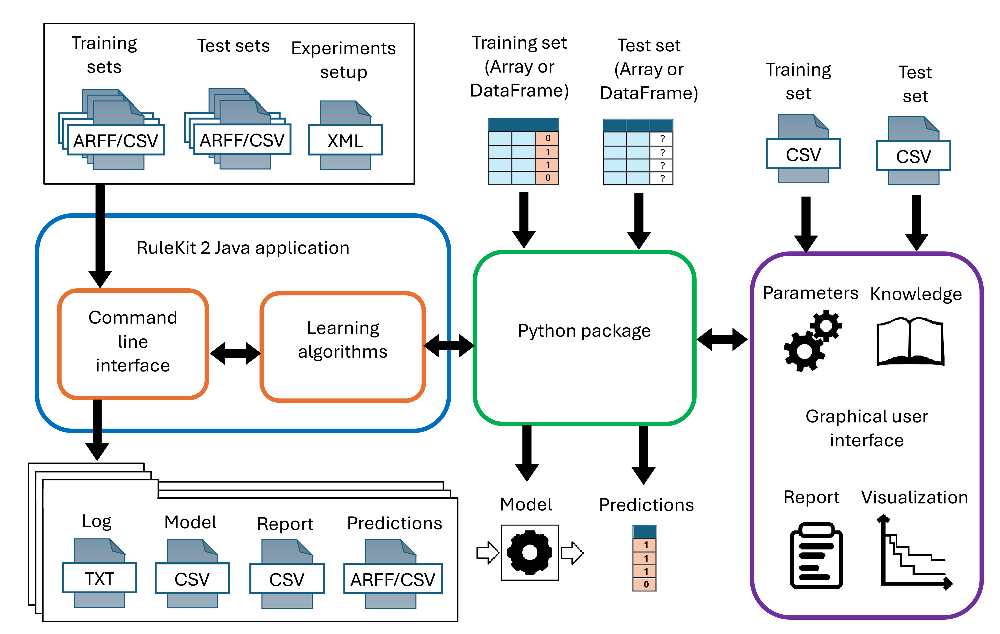
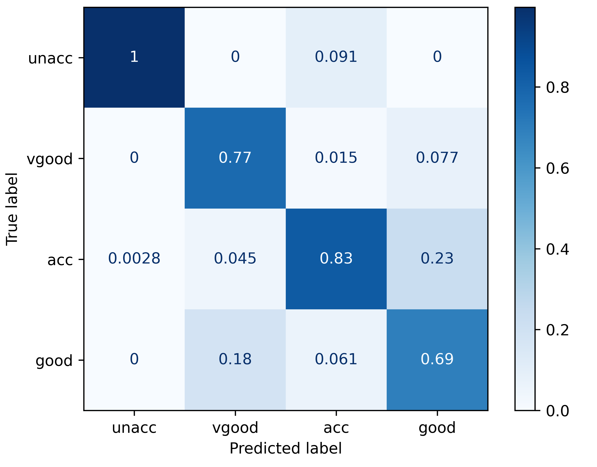
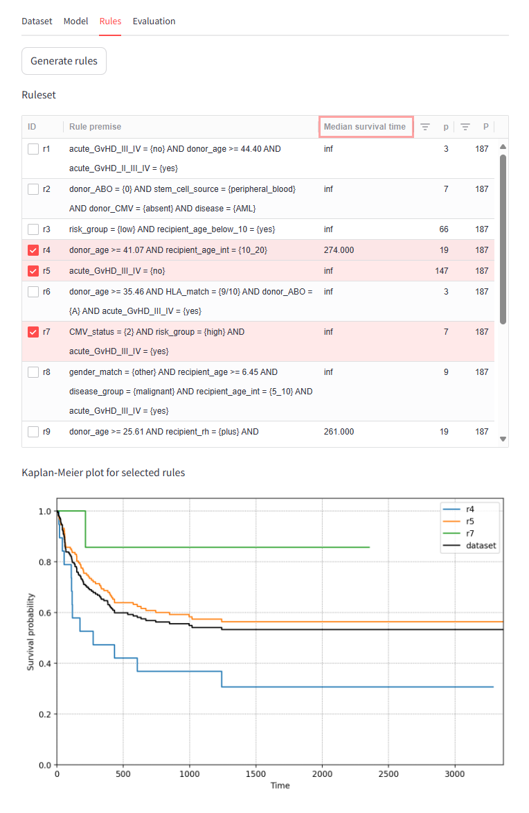

# RuleKit2
[](https://github.com/adaa-polsl/RuleKit/releases)
[](https://www.pepy.tech/projects/rulekit)
[](../../actions/workflows/main.yml)
[](https://www.gnu.org/licenses/agpl-3.0.en.html)


Rule-based models are often used for data analysis as they combine interpretability with predictive power. We present RuleKit2, a versatile tool for rule learning. Based on a sequential covering induction algorithm, it comes with a set of useful features:
* Suitability for different kind of problems:    
    * classification,
    * regression,
    * survival. 
* User-guided induction for verifying hypotheses concerning data dependencies which are expected or of interest.
* Contrast set mining.
* Different experimental environments:   
    * standalone command line tool implemented in Java,
    * Python package: [https://github.com/adaa-polsl/RuleKit-python](https://github.com/adaa-polsl/RuleKit-python),
    * browser application  with a graphical user interface: [https://ruleminer.github.io/rulekit-gui](https://ruleminer.github.io/rulekit-gui).
* Documented Java API: [https://adaa-polsl.github.io/RuleKit](https://adaa-polsl.github.io/RuleKit). 
  
Unlike the first revision, RuleKit2 does not depend on RapidMiner. Running RuleKit as a RapidMiner plugin and R package is no longer supported in version 2. The overview of RuleKit2 architecture is presented below.



RuleKit provides latest versions of our algorithms (some of them were initially published as independent packages and integrated later):
* LR-Rules ([Wróbel et al, 2017](https://bmcbioinformatics.biomedcentral.com/articles/10.1186/s12859-017-1693-x)) - survival rules induction,
* GuideR ([Sikora et al, 2019](https://www.sciencedirect.com/science/article/abs/pii/S0950705119300802?dgcid=coauthor)) - user-guided induction.
* RuleKit-CS ([Gudyś et al, 2024](https://www.sciencedirect.com/science/article/pii/S0957417424002410?dgcid=author)) - contrast set mining.

# Getting started

In the following subsections we provide a brief introduction on how to install and use RuleKit batch interface. The software requires Java Development Kit in version 8 (version 1.8.0 tested) to work properly. In Windows one can download the installer from Oracle webpage. In Linux, a system package manager should be used instead. For instance, in Ubuntu 16.04 execute the following command:
```
sudo apt-get install default-jdk
``` 

## Batch interface

In order to use batch mode, please download *rulekit-\<version\>-all.jar* file from the [releases](../../releases) folder. Alternatively, one can build the package from the sources by running the following commands in the *adaa.analytics.rules* directory of this repository. 
Windows:
```
gradlew -b build.gradle rjar
```
Linux:
```
./gradlew -b build.gradle rjar
```
The JAR file will be placed in *adaa.analytics.rules/build/libs* subdirectory. Once the package has been downloaded/built, the analysis can be performed. The example batch experiment concerns the problem of classifying whether a person making a purchase will be a future customer. The corresponding dataset is named *deals* and is split into train and test parts ([download](data/deals)). To run the experiment, copy RuleKit JAR file into *./examples* folder of the repository and execute:
```
java -jar rulekit-<version>-all.jar minimal-deals.xml
```
The results of the analysis will be located in *./examples/results-minimal/deals/* folder. Note, that the repository already contains reference results - they will be overwritten. See [this Wiki section](https://github.com/adaa-polsl/RuleKit/wiki/1-Batch-interface) for detailed information on how to configure batch analyses in RuleKit. 

## Python package

The full documentation of RuleKit-python can be found [here](https://github.com/adaa-polsl/RuleKit-python). 

Installation from command line: 
```bash
pip install rulekit
```

Code snippet performing classification analysis on the example data set with results visualization.
```python
import pandas
import matplotlib.pyplot as plt
from sklearn.metrics import ConfusionMatrixDisplay
from rulekit.classification import RuleClassifier
from rulekit.params import Measures

URL = 'https://github.com/adaa-polsl/RuleKit/raw/refs/heads/master/data/car/'

train = pandas.read_parquet(URL + 'train.parquet')
X = train.drop('class', axis=1)
y = train['class']

test = pandas.read_parquet(URL + 'test.parquet')
X_test = test.drop('class', axis=1)
y_test = test['class']

clf = RuleClassifier(
    minsupp_new=1,
    induction_measure=Measures.C2,
    pruning_measure=Measures.C2,
    voting_measure=Measures.Correlation)
clf.fit(X, y)

disp = ConfusionMatrixDisplay.from_predictions(
    y_test, clf.predict(X_test), labels=y.unique(),
    normalize='pred', cmap='Blues')
```

The resulting confusion matrix looks as presented below.



## Graphical user interface

RuleKit2 GUI is available through browser application: [https://ruleminer.github.io/rulekit-gui](https://ruleminer.github.io/rulekit-gui). The screenshot illustrating the analysis of the example survival data set was presented below.



# Documentation

The detailed RuleKit documentation can be found on [Wiki pages](https://github.com/adaa-polsl/RuleKit/wiki) which cover the following topics: 


1. [Batch interface](https://github.com/adaa-polsl/RuleKit/wiki/1-Batch-interface)
    1. [General information](https://github.com/adaa-polsl/RuleKit/wiki/1-Batch-interface#11-general-information)
    2. [Parameter set definition](https://github.com/adaa-polsl/RuleKit/wiki/1-Batch-interface#12-parameter-set-definition)
    3. [Dataset definition](https://github.com/adaa-polsl/RuleKit/wiki/1-Batch-interface#13-dataset-definition)
    4. [Example](https://github.com/adaa-polsl/RuleKit/wiki/1-Batch-interface#14-example)
2. [Graphical user interface](https://github.com/adaa-polsl/RuleKit/wiki/2-GUI)
3. [Python package](https://github.com/adaa-polsl/RuleKit/wiki/3-Python-package)
4. [Quality and evaluation](./4-Quality-and-evaluation)
    1. [Rule quality](https://github.com/adaa-polsl/RuleKit/wiki/4-Quality-and-evaluation#41-rule-quality)
	2. [Model characteristics](https://github.com/adaa-polsl/RuleKit/wiki/4-Quality-and-evaluation#42-model-characteristics)
	3. [Performance metrices](https://github.com/adaa-polsl/RuleKit/wiki/4-Quality-and-evaluation#43-performance-metrices)
5. [Output files](https://github.com/adaa-polsl/RuleKit/wiki/5-Output-files)
    1. [Training report](https://github.com/adaa-polsl/RuleKit/wiki/5-Output-files#51-training-report)
    2. [Prediction performance report](https://github.com/adaa-polsl/RuleKit/wiki/5-Output-files#52-prediction-performance-report)    	
6. [User-guided induction](https://github.com/adaa-polsl/RuleKit/wiki/6-User-guided-induction)
	1. [Defining user's knowledge](https://github.com/adaa-polsl/RuleKit/wiki/6-User-guided-induction#61-defining-users-knowledge)
	2. [Examples from GuideR paper](https://github.com/adaa-polsl/RuleKit/wiki/6-User-guided-induction#62-examples-from-guider-paper)
7. [Contrast set mining](https://github.com/adaa-polsl/RuleKit/wiki/7-Contrast-set-mining)	
8. [Library API](https://github.com/adaa-polsl/RuleKit/wiki/8-Library-API)
9. [Empirical results](https://github.com/adaa-polsl/RuleKit/wiki/9-Empirical-results)

JavaDoc for the project is available [here](https://adaa-polsl.github.io/RuleKit/).  

# Datasets 

The repository contains the datasets used in the GuideR study. We also provide the latest UCI revision of the [*Bone marrow transplant: children*](https://github.com/adaa-polsl/RuleKit/blob/master/data/bone-marrow-uci.arff) dataset. We recommend using this dataset at it contains lots of improvements compared to the previous release (e.g., textual encoding of attribute values). 

# Authors and licensing

## Contributors

* [Adam Gudyś](https://github.com/agudys)
* [Łukasz Wróbel](https://github.com/l-wrobel)
* [Marek Sikora](https://github.com/mrksikora)
* [Cezary Maszczyk](https://github.com/cezary986)
* [Wojciech Górka](https://github.com/wgorkaemag)
* Mateusz Kalisch
* [Joanna Badura](https://github.com/AsiaHenzel)
* [Paweł Matyszok](https://github.com/pmatyszok)
* [Wojciech Sikora](https://github.com/Denominatee)
* Dawid Macha

Everyone interested in RuleKit development is welcome to contribute. The preferred way is to use GitHub issues and pull requests.

## Licencing, commercial applications

The software is publicly available under [GNU AGPL-3.0 license](LICENSE). Any derivative work obtained under this license must be licensed under the AGPL if this derivative work is distributed to a third party.
For commercial projects that require the ability to distribute RuleKit code as part of a program that cannot be distributed under the AGPL, it may be possible to obtain an appropriate license from the authors.
 
# Citing

[Gudyś, A, Maszczyk, C, Badura, J, Grzelak, A, Sikora, M, Wróbel, Ł (2025) RuleKit 2: Faster and simpler rule learning, arXiv:2504.20650](https://arxiv.org/abs/2504.20650)

[Gudyś, A, Sikora, M, Wróbel, Ł (2024) Separate and conquer heuristic allows robust mining of contrast sets in classification, regression, and survival data, Expert Systems with Applications, 248: 123376](https://www.sciencedirect.com/science/article/pii/S0957417424002410?dgcid=author)

[Gudyś, A, Sikora, M, Wróbel, Ł (2020) RuleKit: A comprehensive suite for rule-based learning, Knowledge-Based Systems, 194: 105480](https://doi.org/10.1016/j.knosys.2020.105480)

[Sikora, M, Wróbel, Ł, Gudyś, A (2019) GuideR: a guided separate-and-conquer rule learning in classification, regression, and survival settings, Knowledge-Based Systems, 173:1-14.](https://www.sciencedirect.com/science/article/abs/pii/S0950705119300802?dgcid=coauthor)

[Wróbel, Ł, Gudyś, A, Sikora, M (2017) Learning rule sets from survival data, BMC Bioinformatics, 18(1):285.](https://bmcbioinformatics.biomedcentral.com/articles/10.1186/s12859-017-1693-x) 

